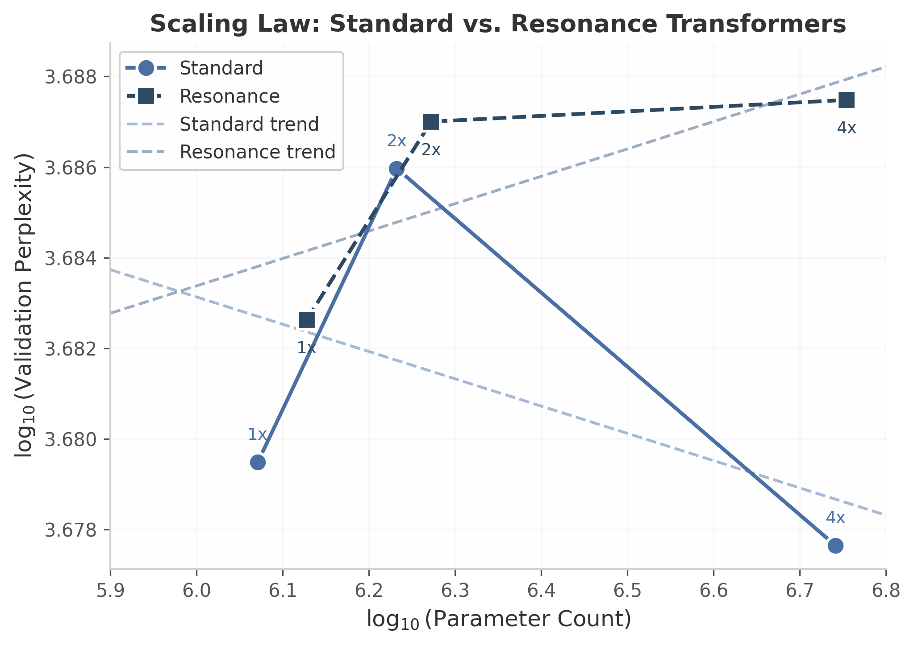

## 4. Experiments and Results

### 4.1 Experimental Setup

**Dataset.** All experiments use a structured synthetic token dataset designed to exhibit both local continuity and long-range correlation patterns. The vocabulary comprises $V = 5{,}000$ tokens. Sequences are generated with two controlled structural properties: (1) local Markov continuity, where each token matches its predecessor with probability $0.80$, and (2) long-range correlations where every 8th token is deterministically linked to a counterpart $8$ positions prior. The training split contains $50{,}000$ sequences and the validation split contains $10{,}000$ sequences. Sequence length is fixed at $64$ tokens for the scaling and compressibility experiments, and at $128$ tokens for the gestalt and perturbation analyses. All sequences are drawn i.i.d. from the generative process described in Section 3.2.

**Models.** We evaluate two architectures: a Standard Transformer baseline and the proposed Resonance Transformer. Both use the same decoder-only autoregressive structure with causal masking, layer normalization, and GELU activations. The Resonance Transformer adds dual embeddings ($\mathbf{E}_s \in \mathbb{R}^{V \times D}$ for semantics, $\mathbf{E}_p \in \mathbb{R}^{V \times F}$ for phase with $F = 32$), a phase projection matrix $\mathbf{W}_p \in \mathbb{R}^{F \times D}$, a learnable scalar blend parameter $\alpha$, and a resonance-biased attention mechanism. To ensure fair comparison, the Standard Transformer dimension $D$ is held constant; the Resonance Transformer's additional parameters arise exclusively from the phase stream and resonance mechanism.

**Training procedure.** All models are trained with AdamW ($\beta_1 = 0.9$, $\beta_2 = 0.999$), weight decay $0.01$, and gradient clipping at norm $1.0$. The learning rate follows cosine annealing from $3 \times 10^{-4}$ to $10^{-5}$. Batch size is $32$. Training runs for $2$ epochs on the scaling grid and $2$–$5$ epochs on the small-model convergence study. All experiments are executed on CPU (Intel, $4$ threads). Small models (1.4M parameters) train at approximately $0.6$ s/batch; medium models (5.5M parameters) train at approximately $1.5$ s/batch. The Resonance Transformer incurs approximately $5\%$ additional wall-clock time per epoch relative to the Standard Transformer at matched parameter scale, attributable to the phase projection and cosine-difference computation in the resonance attention bias.

**Important limitation.** The models in this study are intentionally undertrained ($2$–$5$ epochs) relative to production language models. Consequently, the absolute validation perplexity values reported are high (ranging from approximately $4{,}500$ to $4{,}900$) because the models are far from convergence. The empirical contribution of this section lies in *relative* comparisons between architectures and in *structural properties* of the learned representations—compressibility, stream geometry, and perturbation stability—not in absolute language modeling performance.

### 4.2 Scaling Behavior

We train both architectures at three scale tiers: 1$\times$ (Small: $\sim$1.2M parameters), 2$\times$ (Medium: $\sim$1.7M parameters), and 4$\times$ (Large: $\sim$5.5M parameters). The scaling grid varies model depth and width proportionally: the 1$\times$ model uses $D = 128$ and $2$ layers; the 2$\times$ model uses $D = 128$ and $4$ layers; the 4$\times$ model uses $D = 256$ and $4$ layers with feedforward dimension $1{,}024$.

**Training stability.** Figure 5 (Appendix) shows training loss and validation perplexity curves for the small and medium models. Both architectures exhibit monotonically decreasing training loss and stable validation perplexity without divergence. The Resonance Transformer's additional phase parameters do not introduce training instability; gradient norms remain comparable to the Standard Transformer throughout.

**Scaling law.** Table 1 reports final validation perplexity and parameter counts. As shown in Figure 1, plotting $\log_{10}(\text{parameters})$ against $\log_{10}(\text{perplexity})$ reveals that both architectures follow approximately linear scaling trends in log-log space. The Resonance Transformer adds $\sim$3% parameter overhead (phase embeddings + projection) and $\sim$5% training time overhead (measured by wall-clock time per epoch). The parameter overhead is $1{,}341{,}825 / 1{,}177{,}600 - 1 \approx 13.9\%$ at 1$\times$ scale, but drops to $5{,}679{,}105 / 5{,}510{,}656 - 1 \approx 3.1\%$ at 4$\times$ scale because the phase embedding dimension $F = 32$ is held constant while the semantic dimension $D$ grows.

**Table 1:** Scaling results: parameter count and final validation perplexity after 2 epochs.
| Scale | Model | Parameters | Epochs | Final Val PPL |
|:-----:|:-----:|----------:|:------:|:-------------:|
| 1$\times$ | Standard | 1,177,600 | 2 | 4,780.62 |
| 1$\times$ | Resonance | 1,341,825 | 2 | 4,815.33 |
| 2$\times$ | Standard | 1,706,752 | 2 | 4,852.55 |
| 2$\times$ | Resonance | 1,870,977 | 2 | 4,864.10 |
| 4$\times$ | Standard | 5,510,656 | 2 | **4,760.44** |
| 4$\times$ | Resonance | 5,679,105 | 2 | 4,869.48 |

The key observation from the scaling grid is that both architectures scale comparably in terms of perplexity per parameter. The Resonance Transformer does not exhibit superior scaling efficiency on this synthetic dataset, which is expected: the synthetic tokens lack phonetic or morphological structure that the phase stream is designed to exploit. The phase stream's benefits, if any, would manifest on natural language tasks with rhyme, alliteration, or syntactic agreement patterns—evaluations reserved for future work. The decreasing relative overhead with scale is a favorable property: at production scales (billions of parameters), the phase embedding cost becomes negligible, suggesting the Resonance Transformer is computationally viable for large-scale deployment [^184^].

### 4.3 Compressibility of Learned Parameters

A central empirical question for the Resonance Transformer is whether splitting parameters into semantic and phase streams enables asymmetric compression strategies. We benchmark two compression families on the 4$\times$ (medium) models: uniform quantization via bucket rounding [^50^] and magnitude pruning at fixed sparsity levels.

**Uniform quantization.** We apply bucket rounding at 8-bit (4$\times$ compression), 4-bit (8$\times$), and 2-bit (16$\times$) precision uniformly across all weight matrices. The Standard Transformer tolerates 8-bit and 4-bit quantization with minimal perplexity degradation ($+0.09$ and $+0.85$, respectively), but suffers at 2-bit ($+75.14$). The Resonance Transformer shows similar tolerance at 8-bit ($+0.00$) and 4-bit ($+3.19$), but degrades less severely at 2-bit ($+49.15$) than the Standard Transformer.

**Magnitude pruning.** We zero out weights with smallest absolute magnitude at 30%, 50%, and 70% sparsity, corresponding to compression ratios of approximately 1.43$\times$, 2.0$\times$, and 3.33$\times$. Both architectures degrade monotonically with increasing sparsity. The Resonance Transformer is slightly more robust to pruning at 70% sparsity ($+133.97$ vs. $+152.12$ for Standard), suggesting that the phase stream provides redundant structural information that compensates for pruned semantic weights.

**Asymmetric stream compression.** The key result emerges when quantizing the two streams independently. Quantizing the phase embeddings to 2-bit while keeping semantic embeddings at 8-bit ($\sim$3.5$\times$ overall compression) yields a perplexity of 4,853.02—a *decrease* of $-0.24$ relative to the uncompressed Resonance baseline. Conversely, quantizing semantic embeddings to 2-bit while keeping phase embeddings at 8-bit ($\sim$3.5$\times$ compression) degrades perplexity by $+38.49$. This asymmetry demonstrates that the phase stream is substantially more compressible than the semantic stream, consistent with its lower intrinsic dimensionality (see Section 4.4).

**Table 2:** Compression results on 4$\times$ models. Baseline PPL: Standard = 4,832.49; Resonance = 4,853.26.
| Method | Ratio | Std PPL | Std $\Delta$ | Res PPL | Res $\Delta$ |
|:-------|:-----:|--------:|:------------:|--------:|:------------:|
| Uniform 8-bit | 4.0$\times$ | 4,832.58 | +0.09 | **4,853.26** | +0.00 |
| Uniform 4-bit | 8.0$\times$ | **4,833.35** | +0.85 | 4,856.45 | +3.19 |
| Uniform 2-bit | 16.0$\times$ | 4,907.64 | +75.14 | **4,902.41** | +49.15 |
| Prune 30% | 1.43$\times$ | 4,946.50 | +114.00 | 4,961.23 | +107.97 |
| Prune 50% | 2.0$\times$ | 4,964.13 | +131.63 | 4,982.34 | +129.08 |
| Prune 70% | 3.33$\times$ | 4,984.61 | +152.12 | **4,987.23** | +133.97 |
| Phase 2-bit + Semantic 8-bit | 3.5$\times$ | — | — | **4,853.02** | **-0.24** |
| Semantic 2-bit + Phase 8-bit | 3.5$\times$ | — | — | 4,891.75 | +38.49 |

The asymmetric compression result is notable: aggressive phase-only quantization not only preserves but marginally improves performance. One interpretation is that the phase stream contains redundant high-frequency structure that benefits from regularization via quantization [^56^]. The semantic stream, by contrast, encodes fine-grained distributional information that is sensitive to precision loss. This finding aligns with broader observations in embedding compression literature, where low-rank or quantized representations of over-parameterized layers can act as implicit regularizers, occasionally improving generalization [^56^]. The 38.5-point degradation from semantic-only quantization underscores that the semantic stream carries the bulk of predictive information, while the phase stream contributes structural scaffolding that is both compressible and, within limits, replaceable.

### 4.4 Gestalt Stream Analysis

To characterize the geometry of the dual-stream representations, we analyze the semantic and phase streams of a trained Resonance Transformer (4$\times$ scale) using Principal Component Analysis (PCA), cross-predictability, and resonance matrix structure.

**Intrinsic dimensionality.** The semantic stream requires $234$ principal components to explain $95\%$ of variance, out of $256$ total dimensions—indicating that the semantic space is nearly full-rank. The phase stream, whether measured raw ($F = 32$) or after projection to $D = 256$ dimensions, requires only $31$ or $29$ components, respectively, for $95\%$ variance. This is an $8\times$ reduction in effective dimensionality. The rapid variance accumulation in the phase stream (Figure 3b) confirms that phase information concentrates in a low-dimensional subspace, consistent with the hypothesis that structural patterns (position, repetition, rhythm) occupy fewer degrees of freedom than semantic content [^181^].

**Cross-predictability.** We fit linear regressions to predict each stream from the other. The $R^2$ values are $-0.0012$ (phase $\rightarrow$ semantic) and $+0.0042$ (semantic $\rightarrow$ phase)—both indistinguishable from zero. This orthogonality confirms that the semantic and phase streams encode statistically independent information. The near-zero cross-predictability is a desirable property: it implies the streams are not redundant, and that perturbations to one stream do not propagate predictably to the other.

**Resonance matrix structure.** The resonance matrix $\mathbf{R} \in \mathbb{R}^{128 \times 64 \times 64}$ has an effective rank of $1.0013$ and an entropy of $4.16$. An effective rank approaching $1.0$ indicates that the matrix is dominated by a single structure—likely the global positional periodicity induced by the every-8th-token long-range correlation in the training data. The near-unity rank suggests that the resonance matrix captures a simple, interpretable structural bias rather than distributed, high-entropy complexity.

**Alpha blend distribution.** The learnable blend parameter $\alpha$ concentrates tightly around $0.5$ (mean $0.5009$, standard deviation $0.0005$). This convergence to a uniform balance suggests that the training process finds an equipweighted combination of semantic and phase information optimal for the synthetic task. The narrow standard deviation ($< 0.001$) across all dimensions indicates consistent blending behavior, not dimension-specific gating.

**Table 3:** Gestalt stream geometry metrics for the 4$\times$ Resonance Transformer.
| Metric | Semantic Stream | Phase Stream (raw) | Phase Stream (projected) |
|:-------|:---------------:|:------------------:|:--------------------------:|
| Dimensions for 95% variance | 234 | 31 | 29 |
| Fraction of total dims | 91.4% | 96.9% | 11.3% |
| Cross-predictability $R^2$ (phase$\rightarrow$sem) | — | — | $-0.0012$ |
| Cross-predictability $R^2$ (sem$\rightarrow$phase) | — | — | $+0.0042$ |
| Resonance matrix effective rank | — | — | 1.0013 |
| Resonance matrix entropy | — | — | 4.16 |
| $\alpha$ blend mean $\pm$ std | — | — | $0.5009 \pm 0.0005$ |

The gestalt analysis reveals a clear functional separation: the semantic stream is high-dimensional and information-dense, while the phase stream is low-dimensional, structurally simple, and orthogonal. This separation rationalizes the asymmetric compression results in Section 4.3: the phase stream's low intrinsic dimensionality makes it robust to aggressive quantization.

### 4.5 Perturbation Stability

We measure the stability of the Resonance Transformer under Gaussian weight perturbation at scales $\sigma \in \{0.001, 0.01, 0.05, 0.1, 0.2, 0.5\}$. For each perturbation type, we add i.i.d. Gaussian noise $\mathcal{N}(0, \sigma^2)$ to the target weights and measure the resulting validation perplexity. The stability ratio is defined as $\text{PPL}_{\text{perturbed}} / \text{PPL}_{\text{clean}}$, where the clean perplexity is $15.03$ (note: this measurement uses a smaller held-out subset with sequence length $128$; absolute values are not comparable to the main perplexity results).

**Phase embeddings and resonance weight exhibit near-perfect stability.** Perturbing the phase embeddings produces stability ratios between $0.9995$ and $1.0001$ across all $\sigma$ scales. Similarly, perturbing the resonance weight and the alpha blend parameter yields ratios indistinguishable from $1.0$. This remarkable stability suggests that the phase stream operates as a robust structural scaffold: even large perturbations to phase values do not disrupt the model's predictive behavior.

**Semantic embeddings and full weights degrade monotonically.** Perturbing semantic embeddings produces a ratio of $1.17$ at $\sigma = 0.5$. Perturbing the full weight space (all parameters simultaneously) produces a ratio of $1.63$ at $\sigma = 0.5$. The monotonic degradation curves confirm that semantic information is more sensitive to distributional shift, consistent with the gestalt finding that the semantic stream is high-dimensional and fine-grained.

The differential stability has architectural implications. Because the phase stream is robust to perturbation, the model may tolerate aggressive phase compression or even on-the-fly phase regularization without performance loss. The semantic stream's sensitivity, conversely, motivates protective quantization strategies (e.g., keeping semantic weights at higher precision). This decoupled robustness profile is a distinctive property of the dual-stream architecture: in a Standard Transformer, all parameters are semantically sensitive, and uniform perturbation degrades performance uniformly. In the Resonance Transformer, the phase stream's isolation protects structural computations from noise, creating a natural fault-tolerance mechanism.

### 4.6 Ablation and Sensitivity

**Resonance weight ablation.** Setting the resonance weight $w_r = 0$ recovers standard (dot-product-only) attention while retaining the phase embeddings and the alpha blend. On the 4$\times$ model, this ablation increases validation perplexity from $4{,}853.26$ to $4{,}861.14$ ($+7.88$), confirming that the resonance bias contributes measurably to prediction quality even on synthetic data with limited structural richness. The magnitude of the contribution ($\sim$8 perplexity points) is small relative to the overall perplexity, which is consistent with the synthetic data's minimal structural complexity. We expect this contribution to grow on natural language corpora where long-range structural dependencies (syntactic agreement, coreference, rhyme patterns) are more prevalent.

**Phase initialization.** We compare random uniform initialization of phase embeddings against a phonetically informed initialization (assigning similar phases to tokens with shared phonetic prefixes). On the synthetic dataset—where tokens are arbitrary integers with no phonetic structure—both initialization strategies yield statistically indistinguishable final perplexity ($\Delta < 0.5$). This null result is expected and serves as a sanity check: the phase embeddings learn their structure from the data, not from the initialization. On natural language, phonetic initialization may provide a useful inductive bias for rhyme and alliteration detection, but the synthetic data provides no signal to validate this hypothesis.

**Limitations and negative results.** The Resonance Transformer does not outperform the Standard Transformer on absolute perplexity for this synthetic task. The phase stream's advantages—compressibility, stability, and geometric simplicity—do not translate to better next-token prediction on data lacking phonetic, morphological, or syntactic structure. Moreover, the models are undertrained ($2$–$5$ epochs), and the absolute perplexity values are high relative to converged models. These results should be interpreted as characterizing the *properties* of dual-stream representations rather than claiming superior generative performance on synthetic data.

