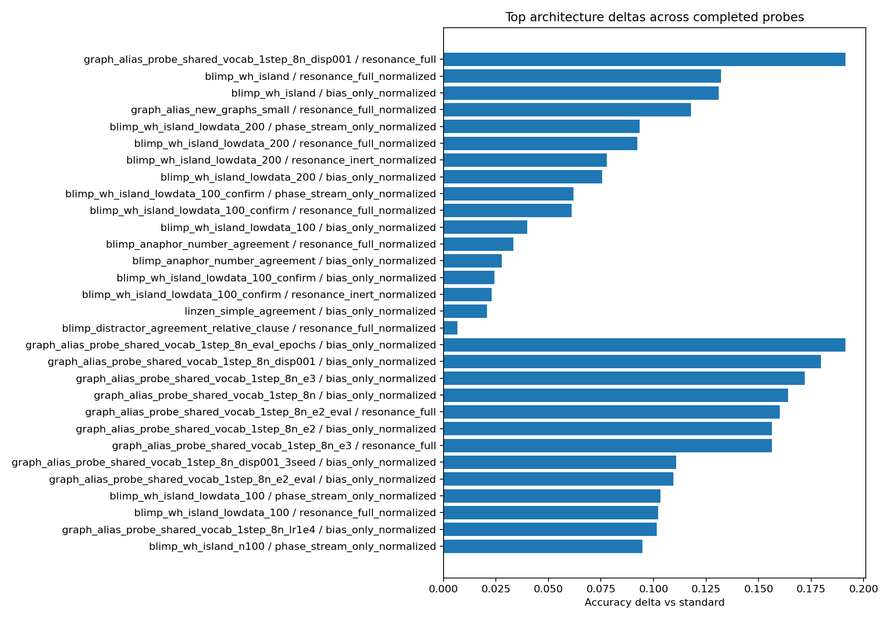
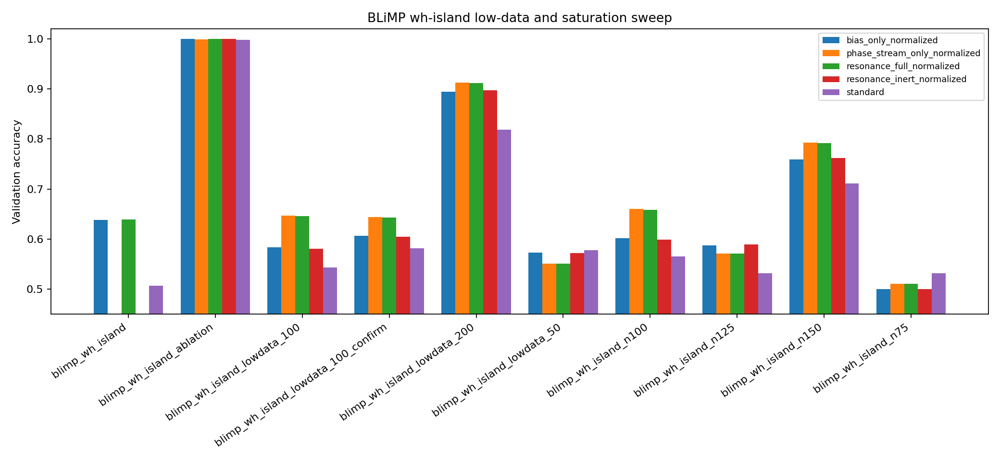
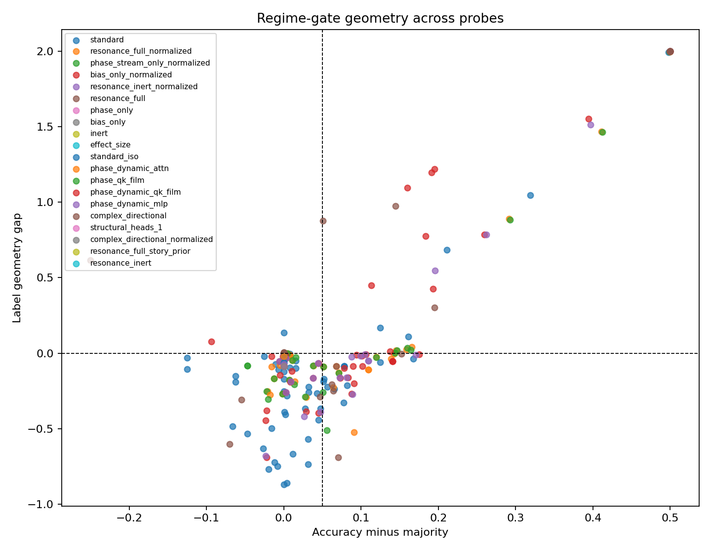
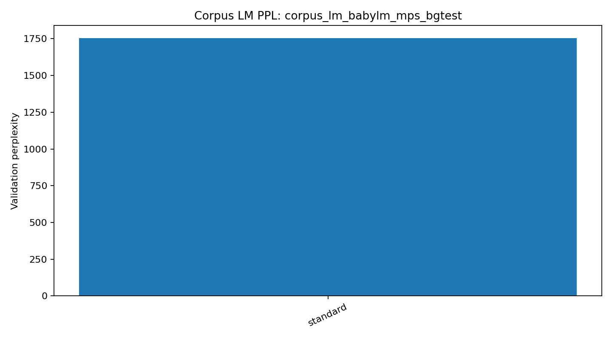
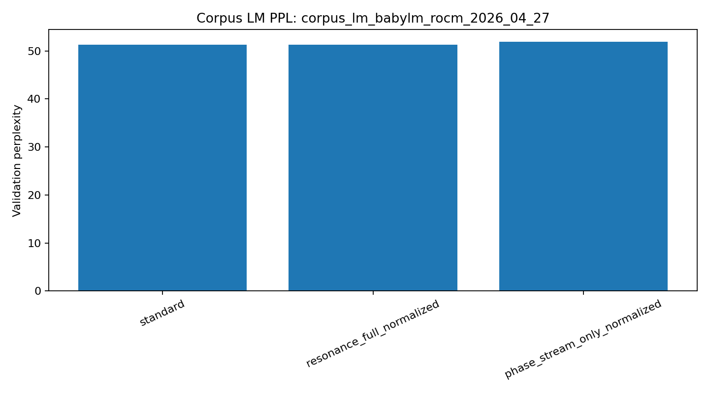
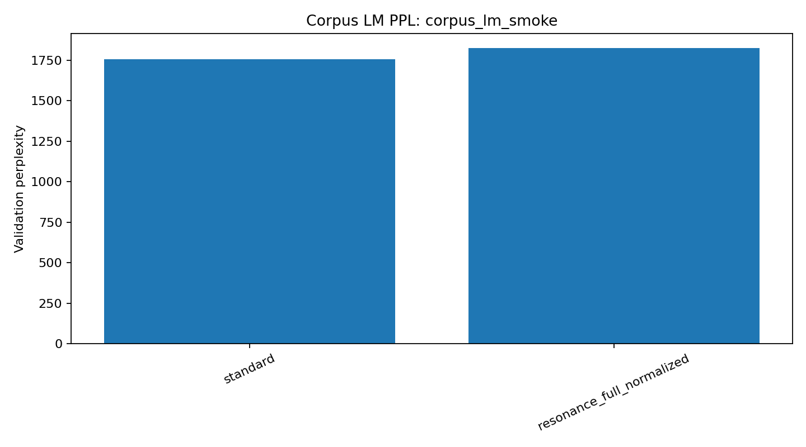

# Resonance Transformer Lab Notebook

Generated from local experiment artifacts. This notebook is intentionally empirical: it records what ran, what moved, and what the current claims should be.

## Current Read

- The original strong claim has narrowed in the right direction: current evidence supports investigating a separate phase/structural channel, not yet a causal win for the resonance attention bias.
- The best natural-language signal remains BLiMP `wh_island` in a low-data regime. The effect is an accuracy hint with marginal loss/geometry support, so it is a candidate regime, not a result.
- Several simple agreement probes and saturated settings are useful negatives: they prevent us from mistaking easy lexical or data-regime effects for topology.
- Full resonance and phase-only often track each other closely; bias-only and inert often track each other closely. That pairing is now a key diagnostic.

## Artifact Inventory

- Completed run directories found: `71`.
- Condition rows: `276`.
- Corpus LM rows: `6`.
- Gate row counts: pass `35`, partial `112`, fail `129`.

## Plots

## Most Interesting Architecture Deltas

| run | condition | acc | delta vs standard | loss gain | label gap | verdict |
|---|---|---:|---:|---:|---:|---|
| graph_alias_probe_shared_vocab_1step_8n_disp001 | resonance_full | 0.6953 | 0.1914 | -0.0270 | 0.3034 | weak: training barely reduces answer loss |
| blimp_wh_island | resonance_full_normalized | 0.6389 | 0.1322 | 0.0618 | -0.0366 | candidate: learnable and non-saturated |
| blimp_wh_island | bias_only_normalized | 0.6378 | 0.1311 | 0.0660 | 0.0118 | candidate: learnable and non-saturated |
| graph_alias_new_graphs_small | resonance_full_normalized | 0.5911 | 0.1178 | -1.1966 | -0.5247 | weak: training barely reduces answer loss |
| blimp_wh_island_lowdata_200 | phase_stream_only_normalized | 0.9122 | 0.0933 | 0.4627 | 1.4653 | weak: task is close to saturated |
| blimp_wh_island_lowdata_200 | resonance_full_normalized | 0.9111 | 0.0922 | 0.4599 | 1.4658 | weak: task is close to saturated |
| blimp_wh_island_lowdata_200 | resonance_inert_normalized | 0.8967 | 0.0778 | 0.3803 | 1.5141 | weak: task is close to saturated |
| blimp_wh_island_lowdata_200 | bias_only_normalized | 0.8944 | 0.0756 | 0.3824 | 1.5524 | weak: task is close to saturated |
| blimp_wh_island_lowdata_100_confirm | phase_stream_only_normalized | 0.6438 | 0.0619 | 0.0100 | 0.0009 | weak: training barely reduces answer loss |
| blimp_wh_island_lowdata_100_confirm | resonance_full_normalized | 0.6429 | 0.0610 | 0.0066 | -0.0056 | weak: training barely reduces answer loss |
| blimp_wh_island_lowdata_100 | bias_only_normalized | 0.5833 | 0.0400 | -0.0881 | -0.1607 | candidate: learnable and non-saturated |
| blimp_anaphor_number_agreement | resonance_full_normalized | 0.5078 | 0.0333 | 0.0085 | -0.0115 | weak: no condition beats majority baseline by 5 points |
| graph_alias_probe_shared_vocab_1step_8n_eval_epochs | bias_only_normalized | 0.6914 | 0.1914 | -0.4642 | 1.1947 | weak: training barely reduces answer loss |
| graph_alias_probe_shared_vocab_1step_8n_disp001 | bias_only_normalized | 0.6836 | 0.1797 | -0.2449 | 0.7738 | weak: training barely reduces answer loss |
| graph_alias_probe_shared_vocab_1step_8n_e3 | bias_only_normalized | 0.6602 | 0.1719 | -0.3339 | 1.0954 | weak: training barely reduces answer loss |
| graph_alias_probe_shared_vocab_1step_8n | bias_only_normalized | 0.6953 | 0.1641 | -0.4352 | 1.2177 | weak: training barely reduces answer loss |
| graph_alias_probe_shared_vocab_1step_8n_e2_eval | resonance_full | 0.6523 | 0.1602 | 0.0279 | -0.0045 | weak: behavior improves but hidden geometry is not label-separated |
| graph_alias_probe_shared_vocab_1step_8n_e2 | bias_only_normalized | 0.5898 | 0.1562 | -0.1105 | -0.0850 | weak: training barely reduces answer loss |
| graph_alias_probe_shared_vocab_1step_8n_e3 | resonance_full | 0.6445 | 0.1562 | -0.2239 | 0.9742 | weak: training barely reduces answer loss |
| graph_alias_probe_shared_vocab_1step_8n_disp001_3seed | bias_only_normalized | 0.5911 | 0.1107 | -0.6553 | -0.2015 | weak: training barely reduces answer loss |

## Corpus LM Runs

These runs train on BabyLM-style natural text chunks rather than binary structural probes. They are not direct evidence for the topology claim, but they are useful for checking whether the architecture behaves sanely on a real language-modeling objective.

| run | device | condition | chunks | val loss | val ppl | elapsed min |
|---|---|---|---:|---:|---:|---:|
| corpus_lm_babylm_mps_bgtest | mps | standard | 64 | 7.4696 | 1753.8250 | 0.0253 |
| corpus_lm_babylm_rocm_2026_04_27 | cuda | standard | 12000 | 3.9375 | 51.2908 | 2.2438 |
| corpus_lm_babylm_rocm_2026_04_27 | cuda | resonance_full_normalized | 12000 | 3.9387 | 51.3511 | 2.5424 |
| corpus_lm_babylm_rocm_2026_04_27 | cuda | phase_stream_only_normalized | 12000 | 3.9496 | 51.9121 | 2.3353 |
| corpus_lm_smoke | mps | standard | 64 | 7.4696 | 1753.8250 | 0.0241 |
| corpus_lm_smoke | mps | resonance_full_normalized | 64 | 7.5087 | 1823.9039 | 0.0085 |

## Core Negative Controls

- Saturation is common. When every condition reaches very high accuracy, the task cannot identify the useful mechanism.
- Low-data undertraining is also common. Accuracy bumps without loss improvement or label-gap movement should be treated as scouting signal.
- `resonance_inert_normalized` is essential. If inert matches bias-only, the relation bias is not doing meaningful relation-aware work in that regime.

## Next Experimental Decisions

1. Promote only regimes where phase/full beat standard and inert controls on accuracy, loss, and geometry.
2. Add a cheap iso-parameter baseline for the phase path so parameter count is not confounded with the structural-channel claim.
3. Search harder for tasks where full resonance separates from phase-only. Graph/semantic-parse/code-pair probes are better candidates than simple syntax.
4. Use interpretability tools after regime selection: phase ablation, phase quantization, phase-feature clustering, SAE-on-phase, and attention/resonance visualizations.

## Complete Summary Table

| gate | family | run | condition | acc | acc-majority | loss gain | label gap | verdict |
|---|---|---|---|---:|---:|---:|---:|---|
| partial | experiment_plan | blimp_anaphor_number_agreement | bias_only_normalized | 0.5022 | 0.0022 | 0.0037 | -0.0113 | weak: no condition beats majority baseline by 5 points |
| partial | experiment_plan | blimp_anaphor_number_agreement | resonance_full_normalized | 0.5078 | 0.0078 | 0.0085 | -0.0115 | weak: no condition beats majority baseline by 5 points |
| partial | experiment_plan | blimp_anaphor_number_agreement | standard | 0.4744 | -0.0256 | 0.0047 | -0.0221 | weak: no condition beats majority baseline by 5 points |
| partial | experiment_plan | blimp_distractor_agreement_relative_clause | bias_only_normalized | 0.4989 | -0.0011 | 0.0098 | -0.0208 | weak: no condition beats majority baseline by 5 points |
| partial | experiment_plan | blimp_distractor_agreement_relative_clause | resonance_full_normalized | 0.5078 | 0.0078 | 0.0029 | -0.0137 | weak: no condition beats majority baseline by 5 points |
| partial | experiment_plan | blimp_distractor_agreement_relative_clause | standard | 0.5011 | 0.0011 | 0.0075 | -0.0198 | weak: no condition beats majority baseline by 5 points |
| pass | experiment_plan | blimp_wh_island | bias_only_normalized | 0.6378 | 0.1378 | 0.0660 | 0.0118 | candidate: learnable and non-saturated |
| partial | experiment_plan | blimp_wh_island | resonance_full_normalized | 0.6389 | 0.1389 | 0.0618 | -0.0366 | candidate: learnable and non-saturated |
| partial | experiment_plan | blimp_wh_island | standard | 0.5067 | 0.0067 | 0.0089 | -0.0099 | candidate: learnable and non-saturated |
| pass | experiment_plan | blimp_wh_island_ablation | bias_only_normalized | 1.0000 | 0.5000 | 0.6992 | 1.9983 | weak: task is close to saturated |
| pass | experiment_plan | blimp_wh_island_ablation | phase_stream_only_normalized | 0.9989 | 0.4989 | 0.7009 | 1.9947 | weak: task is close to saturated |
| pass | experiment_plan | blimp_wh_island_ablation | resonance_full_normalized | 1.0000 | 0.5000 | 0.7068 | 1.9969 | weak: task is close to saturated |
| pass | experiment_plan | blimp_wh_island_ablation | resonance_inert_normalized | 1.0000 | 0.5000 | 0.6991 | 1.9978 | weak: task is close to saturated |
| pass | experiment_plan | blimp_wh_island_ablation | standard | 0.9978 | 0.4978 | 0.6840 | 1.9939 | weak: task is close to saturated |
| partial | experiment_plan | blimp_wh_island_lowdata_100 | bias_only_normalized | 0.5833 | 0.0833 | -0.0881 | -0.1607 | candidate: learnable and non-saturated |
| pass | experiment_plan | blimp_wh_island_lowdata_100 | phase_stream_only_normalized | 0.6467 | 0.1467 | 0.0273 | 0.0176 | candidate: learnable and non-saturated |
| pass | experiment_plan | blimp_wh_island_lowdata_100 | resonance_full_normalized | 0.6456 | 0.1456 | 0.0264 | 0.0168 | candidate: learnable and non-saturated |
| partial | experiment_plan | blimp_wh_island_lowdata_100 | resonance_inert_normalized | 0.5811 | 0.0811 | -0.0882 | -0.1606 | candidate: learnable and non-saturated |
| fail | experiment_plan | blimp_wh_island_lowdata_100 | standard | 0.5433 | 0.0433 | -0.1850 | -0.2659 | candidate: learnable and non-saturated |
| partial | experiment_plan | blimp_wh_island_lowdata_100_confirm | bias_only_normalized | 0.6062 | 0.1062 | -0.1221 | -0.0087 | weak: training barely reduces answer loss |
| pass | experiment_plan | blimp_wh_island_lowdata_100_confirm | phase_stream_only_normalized | 0.6438 | 0.1438 | 0.0100 | 0.0009 | weak: training barely reduces answer loss |
| partial | experiment_plan | blimp_wh_island_lowdata_100_confirm | resonance_full_normalized | 0.6429 | 0.1429 | 0.0066 | -0.0056 | weak: training barely reduces answer loss |
| partial | experiment_plan | blimp_wh_island_lowdata_100_confirm | resonance_inert_normalized | 0.6048 | 0.1048 | -0.1222 | -0.0077 | weak: training barely reduces answer loss |
| partial | experiment_plan | blimp_wh_island_lowdata_100_confirm | standard | 0.5819 | 0.0819 | -0.1568 | -0.2135 | weak: training barely reduces answer loss |
| pass | experiment_plan | blimp_wh_island_lowdata_200 | bias_only_normalized | 0.8944 | 0.3944 | 0.3824 | 1.5524 | weak: task is close to saturated |
| pass | experiment_plan | blimp_wh_island_lowdata_200 | phase_stream_only_normalized | 0.9122 | 0.4122 | 0.4627 | 1.4653 | weak: task is close to saturated |
| pass | experiment_plan | blimp_wh_island_lowdata_200 | resonance_full_normalized | 0.9111 | 0.4111 | 0.4599 | 1.4658 | weak: task is close to saturated |
| pass | experiment_plan | blimp_wh_island_lowdata_200 | resonance_inert_normalized | 0.8967 | 0.3967 | 0.3803 | 1.5141 | weak: task is close to saturated |
| pass | experiment_plan | blimp_wh_island_lowdata_200 | standard | 0.8189 | 0.3189 | 0.1465 | 1.0473 | weak: task is close to saturated |
| partial | experiment_plan | blimp_wh_island_lowdata_50 | bias_only_normalized | 0.5733 | 0.0733 | -0.0863 | -0.1628 | weak: training barely reduces answer loss |
| partial | experiment_plan | blimp_wh_island_lowdata_50 | phase_stream_only_normalized | 0.5511 | 0.0511 | -0.0514 | -0.0901 | weak: training barely reduces answer loss |
| partial | experiment_plan | blimp_wh_island_lowdata_50 | resonance_full_normalized | 0.5511 | 0.0511 | -0.0513 | -0.0901 | weak: training barely reduces answer loss |
| partial | experiment_plan | blimp_wh_island_lowdata_50 | resonance_inert_normalized | 0.5722 | 0.0722 | -0.0861 | -0.1627 | weak: training barely reduces answer loss |
| partial | experiment_plan | blimp_wh_island_lowdata_50 | standard | 0.5778 | 0.0778 | -0.1562 | -0.3288 | weak: training barely reduces answer loss |
| fail | experiment_plan | linzen_dependency_tsv | bias_only_normalized | 0.4948 | -0.0052 | -0.0111 | -0.1443 | weak: no condition beats majority baseline by 5 points |
| fail | experiment_plan | linzen_dependency_tsv | resonance_full_normalized | 0.4948 | -0.0052 | -0.0025 | -0.0798 | weak: no condition beats majority baseline by 5 points |
| partial | experiment_plan | linzen_dependency_tsv | standard | 0.5156 | 0.0156 | 0.0037 | -0.0976 | weak: no condition beats majority baseline by 5 points |
| fail | experiment_plan | linzen_simple_agreement | bias_only_normalized | 0.5104 | 0.0104 | -0.0108 | -0.1192 | weak: no condition beats majority baseline by 5 points |
| fail | experiment_plan | linzen_simple_agreement | resonance_full_normalized | 0.4844 | -0.0156 | -0.0105 | -0.0885 | weak: no condition beats majority baseline by 5 points |
| partial | experiment_plan | linzen_simple_agreement | standard | 0.4896 | -0.0104 | 0.0020 | -0.0727 | weak: no condition beats majority baseline by 5 points |
| fail | foundational | ablation | bias_only |  |  |  |  |  |
| fail | foundational | ablation | effect_size |  |  |  |  |  |
| fail | foundational | ablation | inert |  |  |  |  |  |
| fail | foundational | ablation | phase_only |  |  |  |  |  |
| fail | foundational | ablation | resonance_full |  |  |  |  |  |
| fail | foundational | ablation | standard |  |  |  |  |  |
| pass | graph_alias_probe_known_medium | graph_alias_probe_known_medium | bias_only_normalized | 1.0000 | 0.5000 | 0.6746 | 1.9999 | weak: task is close to saturated |
| pass | graph_alias_probe_known_medium | graph_alias_probe_known_medium | resonance_full | 1.0000 | 0.5000 | 0.6823 | 1.9998 | weak: task is close to saturated |
| pass | graph_alias_probe_known_medium | graph_alias_probe_known_medium | standard | 1.0000 | 0.5000 | 0.6748 | 1.9999 | weak: task is close to saturated |
| pass | graph_alias_probe_rewired_16n | graph_alias_probe_rewired_16n | bias_only_normalized | 1.0000 | 0.5000 | 0.6696 | 1.9985 | weak: task is close to saturated |
| pass | graph_alias_probe_rewired_16n | graph_alias_probe_rewired_16n | resonance_full | 1.0000 | 0.5000 | 0.6481 | 1.9978 | weak: task is close to saturated |
| pass | graph_alias_probe_rewired_16n | graph_alias_probe_rewired_16n | standard | 1.0000 | 0.5000 | 0.6527 | 1.9987 | weak: task is close to saturated |
| pass | graph_alias_probe_rewired_2step_16n | graph_alias_probe_rewired_2step_16n | bias_only_normalized | 1.0000 | 0.5000 | 0.6438 | 1.9989 | weak: task is close to saturated |
| pass | graph_alias_probe_rewired_2step_16n | graph_alias_probe_rewired_2step_16n | resonance_full | 1.0000 | 0.5000 | 0.6386 | 1.9978 | weak: task is close to saturated |
| pass | graph_alias_probe_rewired_2step_16n | graph_alias_probe_rewired_2step_16n | standard | 1.0000 | 0.5000 | 0.6966 | 1.9992 | weak: task is close to saturated |
| pass | graph_alias_probe_rewired_medium | graph_alias_probe_rewired_medium | bias_only_normalized | 1.0000 | 0.5000 | 0.6754 | 1.9999 | weak: task is close to saturated |
| pass | graph_alias_probe_rewired_medium | graph_alias_probe_rewired_medium | resonance_full | 1.0000 | 0.5000 | 0.6737 | 1.9998 | weak: task is close to saturated |
| pass | graph_alias_probe_rewired_medium | graph_alias_probe_rewired_medium | standard | 1.0000 | 0.5000 | 0.6764 | 1.9999 | weak: task is close to saturated |
| partial | graph_alias_probe_rewired_smoke | graph_alias_probe_rewired_smoke | resonance_full | 0.5000 | 0.0000 | 0.0243 | 0.0043 | weak: no condition beats majority baseline by 5 points |
| partial | graph_alias_probe_rewired_smoke | graph_alias_probe_rewired_smoke | standard | 0.5000 | 0.0000 | -0.0471 | 0.0017 | weak: no condition beats majority baseline by 5 points |
| partial | graph_alias_probe_shared_vocab_1step | graph_alias_probe_shared_vocab_1step | bias_only_normalized | 0.4062 | -0.0938 | -0.8267 | 0.0772 | weak: no condition beats majority baseline by 5 points |
| fail | graph_alias_probe_shared_vocab_1step | graph_alias_probe_shared_vocab_1step | resonance_full | 0.4297 | -0.0703 | -0.8009 | -0.6022 | weak: no condition beats majority baseline by 5 points |
| fail | graph_alias_probe_shared_vocab_1step | graph_alias_probe_shared_vocab_1step | standard | 0.5312 | 0.0312 | -0.5733 | -0.5696 | weak: no condition beats majority baseline by 5 points |
| partial | graph_alias_probe_shared_vocab_1step_8n | graph_alias_probe_shared_vocab_1step_8n | bias_only_normalized | 0.6953 | 0.1953 | -0.4352 | 1.2177 | weak: training barely reduces answer loss |
| partial | graph_alias_probe_shared_vocab_1step_8n | graph_alias_probe_shared_vocab_1step_8n | resonance_full | 0.5703 | 0.0703 | -0.8454 | -0.6886 | weak: training barely reduces answer loss |
| fail | graph_alias_probe_shared_vocab_1step_8n | graph_alias_probe_shared_vocab_1step_8n | standard | 0.5312 | 0.0312 | -1.2267 | -0.7338 | weak: training barely reduces answer loss |
| partial | graph_alias_probe_shared_vocab_1step_8n_disp001 | graph_alias_probe_shared_vocab_1step_8n_disp001 | bias_only_normalized | 0.6836 | 0.1836 | -0.2449 | 0.7738 | weak: training barely reduces answer loss |
| partial | graph_alias_probe_shared_vocab_1step_8n_disp001 | graph_alias_probe_shared_vocab_1step_8n_disp001 | resonance_full | 0.6953 | 0.1953 | -0.0270 | 0.3034 | weak: training barely reduces answer loss |
| fail | graph_alias_probe_shared_vocab_1step_8n_disp001 | graph_alias_probe_shared_vocab_1step_8n_disp001 | standard | 0.5039 | 0.0039 | -1.1140 | -0.8592 | weak: training barely reduces answer loss |
| partial | graph_alias_probe_shared_vocab_1step_8n_disp001_3seed | graph_alias_probe_shared_vocab_1step_8n_disp001_3seed | bias_only_normalized | 0.5911 | 0.0911 | -0.6553 | -0.2015 | weak: training barely reduces answer loss |
| partial | graph_alias_probe_shared_vocab_1step_8n_disp001_3seed | graph_alias_probe_shared_vocab_1step_8n_disp001_3seed | resonance_full | 0.5638 | 0.0638 | -0.5246 | -0.2492 | weak: training barely reduces answer loss |
| fail | graph_alias_probe_shared_vocab_1step_8n_disp001_3seed | graph_alias_probe_shared_vocab_1step_8n_disp001_3seed | standard | 0.4805 | -0.0195 | -1.0844 | -0.7673 | weak: training barely reduces answer loss |
| partial | graph_alias_probe_shared_vocab_1step_8n_e2 | graph_alias_probe_shared_vocab_1step_8n_e2 | bias_only_normalized | 0.5898 | 0.0898 | -0.1105 | -0.0850 | weak: training barely reduces answer loss |
| fail | graph_alias_probe_shared_vocab_1step_8n_e2 | graph_alias_probe_shared_vocab_1step_8n_e2 | resonance_full | 0.5000 | 0.0000 | -0.0165 | -0.0046 | weak: training barely reduces answer loss |
| fail | graph_alias_probe_shared_vocab_1step_8n_e2 | graph_alias_probe_shared_vocab_1step_8n_e2 | standard | 0.4336 | -0.0664 | -0.7009 | -0.4844 | weak: training barely reduces answer loss |
| partial | graph_alias_probe_shared_vocab_1step_8n_e2_eval | graph_alias_probe_shared_vocab_1step_8n_e2_eval | bias_only_normalized | 0.6016 | 0.1016 | -0.0630 | -0.0863 | weak: behavior improves but hidden geometry is not label-separated |
| partial | graph_alias_probe_shared_vocab_1step_8n_e2_eval | graph_alias_probe_shared_vocab_1step_8n_e2_eval | resonance_full | 0.6523 | 0.1523 | 0.0279 | -0.0045 | weak: behavior improves but hidden geometry is not label-separated |
| fail | graph_alias_probe_shared_vocab_1step_8n_e2_eval | graph_alias_probe_shared_vocab_1step_8n_e2_eval | standard | 0.4922 | -0.0078 | -0.7132 | -0.7499 | weak: behavior improves but hidden geometry is not label-separated |
| partial | graph_alias_probe_shared_vocab_1step_8n_e3 | graph_alias_probe_shared_vocab_1step_8n_e3 | bias_only_normalized | 0.6602 | 0.1602 | -0.3339 | 1.0954 | weak: training barely reduces answer loss |
| partial | graph_alias_probe_shared_vocab_1step_8n_e3 | graph_alias_probe_shared_vocab_1step_8n_e3 | resonance_full | 0.6445 | 0.1445 | -0.2239 | 0.9742 | weak: training barely reduces answer loss |
| fail | graph_alias_probe_shared_vocab_1step_8n_e3 | graph_alias_probe_shared_vocab_1step_8n_e3 | standard | 0.4883 | -0.0117 | -1.0834 | -0.7234 | weak: training barely reduces answer loss |
| partial | graph_alias_probe_shared_vocab_1step_8n_eval_epochs | graph_alias_probe_shared_vocab_1step_8n_eval_epochs | bias_only_normalized | 0.6914 | 0.1914 | -0.4642 | 1.1947 | weak: training barely reduces answer loss |
| partial | graph_alias_probe_shared_vocab_1step_8n_eval_epochs | graph_alias_probe_shared_vocab_1step_8n_eval_epochs | resonance_full | 0.5508 | 0.0508 | -0.8361 | 0.8750 | weak: training barely reduces answer loss |
| fail | graph_alias_probe_shared_vocab_1step_8n_eval_epochs | graph_alias_probe_shared_vocab_1step_8n_eval_epochs | standard | 0.5000 | 0.0000 | -1.3963 | -0.8684 | weak: training barely reduces answer loss |
| partial | graph_alias_probe_shared_vocab_1step_8n_lr1e4 | graph_alias_probe_shared_vocab_1step_8n_lr1e4 | bias_only_normalized | 0.6133 | 0.1133 | -0.4763 | 0.4486 | weak: training barely reduces answer loss |
| fail | graph_alias_probe_shared_vocab_1step_8n_lr1e4 | graph_alias_probe_shared_vocab_1step_8n_lr1e4 | resonance_full | 0.5469 | 0.0469 | -0.6441 | -0.2870 | weak: training barely reduces answer loss |
| fail | graph_alias_probe_shared_vocab_1step_8n_lr1e4 | graph_alias_probe_shared_vocab_1step_8n_lr1e4 | standard | 0.5117 | 0.0117 | -0.8623 | -0.6683 | weak: training barely reduces answer loss |
| fail | graph_alias_probe_shared_vocab_2step | graph_alias_probe_shared_vocab_2step | bias_only_normalized | 0.4766 | -0.0234 | -0.6826 | -0.4450 | weak: no condition beats majority baseline by 5 points |
| fail | graph_alias_probe_shared_vocab_2step | graph_alias_probe_shared_vocab_2step | resonance_full | 0.4453 | -0.0547 | -0.4908 | -0.3085 | weak: no condition beats majority baseline by 5 points |
| fail | graph_alias_probe_shared_vocab_2step | graph_alias_probe_shared_vocab_2step | standard | 0.4531 | -0.0469 | -0.7347 | -0.5330 | weak: no condition beats majority baseline by 5 points |
| partial | graph_alias_probe_smoke | graph_alias_probe_smoke | resonance_full | 0.5000 | 0.0000 | -0.0049 | 0.0008 | weak: no condition beats majority baseline by 5 points |
| partial | graph_alias_probe_smoke | graph_alias_probe_smoke | standard | 0.5000 | 0.0000 | -0.0580 | 0.0007 | weak: no condition beats majority baseline by 5 points |
| partial | graph_alias_probe_smoke_same | graph_alias_probe_smoke_same | resonance_full | 0.5000 | 0.0000 | 0.0184 | 0.0047 | weak: no condition beats majority baseline by 5 points |
| partial | graph_alias_probe_smoke_same | graph_alias_probe_smoke_same | standard | 0.5000 | 0.0000 | -0.0629 | 0.0027 | weak: no condition beats majority baseline by 5 points |
| fail | graph_alias_probe_unseen_medium | graph_alias_probe_unseen_medium | bias_only_normalized | 0.5000 | 0.0000 | -1.3020 | -0.0003 | weak: no condition beats majority baseline by 5 points |
| partial | graph_alias_probe_unseen_medium | graph_alias_probe_unseen_medium | resonance_full | 0.2500 | -0.2500 | -2.0685 | 0.6154 | weak: no condition beats majority baseline by 5 points |
| fail | graph_alias_probe_unseen_medium | graph_alias_probe_unseen_medium | standard | 0.5000 | 0.0000 | -1.1808 | -0.0009 | weak: no condition beats majority baseline by 5 points |
| fail | hyper_mps_2026_04_28 | blimp_complex_np_island_n150_mps | phase_dynamic_attn | 0.4822 | -0.0178 | -0.3368 | -0.2755 | weak: no condition beats majority baseline by 5 points |
| fail | hyper_mps_2026_04_28 | blimp_complex_np_island_n150_mps | phase_dynamic_qk_film | 0.4778 | -0.0222 | -0.3596 | -0.3806 | weak: no condition beats majority baseline by 5 points |
| fail | hyper_mps_2026_04_28 | blimp_complex_np_island_n150_mps | phase_qk_film | 0.4800 | -0.0200 | -0.2841 | -0.3048 | weak: no condition beats majority baseline by 5 points |
| fail | hyper_mps_2026_04_28 | blimp_complex_np_island_n150_mps | phase_stream_only_normalized | 0.4778 | -0.0222 | -0.2235 | -0.2521 | weak: no condition beats majority baseline by 5 points |
| fail | hyper_mps_2026_04_28 | blimp_complex_np_island_n150_mps | resonance_full_normalized | 0.4789 | -0.0211 | -0.2237 | -0.2510 | weak: no condition beats majority baseline by 5 points |
| fail | hyper_mps_2026_04_28 | blimp_complex_np_island_n150_mps | standard | 0.5011 | 0.0011 | -0.3641 | -0.3902 | weak: no condition beats majority baseline by 5 points |
| fail | hyper_mps_2026_04_28 | blimp_complex_np_island_n150_mps | standard_iso | 0.4844 | -0.0156 | -0.6138 | -0.4977 | weak: no condition beats majority baseline by 5 points |
| partial | hyper_mps_2026_04_28 | debug_complex_np | phase_dynamic_attn | 0.5000 | 0.0000 | 0.0068 | -0.0194 | weak: no condition beats majority baseline by 5 points |
| fail | hyper_mps_2026_04_28 | debug_complex_np | phase_dynamic_qk_film | 0.4844 | -0.0156 | -0.0058 | -0.0215 | weak: no condition beats majority baseline by 5 points |
| fail | hyper_mps_2026_04_28 | debug_complex_np | phase_qk_film | 0.5156 | 0.0156 | -0.0137 | -0.0262 | weak: no condition beats majority baseline by 5 points |
| fail | hyper_mps_2026_04_28 | debug_complex_np | phase_stream_only_normalized | 0.5000 | 0.0000 | -0.0164 | -0.0398 | weak: no condition beats majority baseline by 5 points |
| fail | hyper_mps_2026_04_28 | debug_complex_np | resonance_full_normalized | 0.5000 | 0.0000 | -0.0164 | -0.0398 | weak: no condition beats majority baseline by 5 points |
| partial | hyper_mps_2026_04_28 | debug_complex_np | standard | 0.5156 | 0.0156 | 0.0072 | -0.0494 | weak: no condition beats majority baseline by 5 points |
| fail | hyper_mps_2026_04_28 | debug_complex_np | standard_iso | 0.5000 | 0.0000 | -0.0292 | -0.0214 | weak: no condition beats majority baseline by 5 points |
| fail | hyper_smoke | wh_island_iso | phase_dynamic_mlp | 0.5000 | 0.0000 | -0.0470 | -0.0726 | weak: no condition beats majority baseline by 5 points |
| fail | hyper_smoke | wh_island_iso | resonance_full_normalized | 0.5000 | 0.0000 | -0.0480 | -0.0876 | weak: no condition beats majority baseline by 5 points |
| fail | hyper_smoke | wh_island_iso | standard | 0.4375 | -0.0625 | -0.0953 | -0.1517 | weak: no condition beats majority baseline by 5 points |
| fail | hyper_smoke | wh_island_iso | standard_iso | 0.4375 | -0.0625 | -0.1383 | -0.1914 | weak: no condition beats majority baseline by 5 points |
| partial | hyper_smoke | wh_island_variants | complex_directional | 0.5000 | 0.0000 | 0.0239 | -0.0861 | weak: behavior improves but hidden geometry is not label-separated |
| partial | hyper_smoke | wh_island_variants | phase_dynamic_attn | 0.6094 | 0.1094 | 0.0371 | -0.1103 | weak: behavior improves but hidden geometry is not label-separated |
| partial | hyper_smoke | wh_island_variants | phase_dynamic_mlp | 0.6094 | 0.1094 | 0.0451 | -0.0488 | weak: behavior improves but hidden geometry is not label-separated |
| partial | hyper_smoke | wh_island_variants | phase_dynamic_qk_film | 0.6406 | 0.1406 | 0.0344 | -0.0530 | weak: behavior improves but hidden geometry is not label-separated |
| fail | hyper_smoke | wh_island_variants | phase_qk_film | 0.4531 | -0.0469 | -0.0043 | -0.0842 | weak: behavior improves but hidden geometry is not label-separated |
| partial | hyper_smoke | wh_island_variants | phase_stream_only_normalized | 0.5000 | 0.0000 | 0.0239 | -0.0861 | weak: behavior improves but hidden geometry is not label-separated |
| partial | hyper_smoke | wh_island_variants | resonance_full_normalized | 0.5000 | 0.0000 | 0.0239 | -0.0861 | weak: behavior improves but hidden geometry is not label-separated |
| partial | hyper_smoke | wh_island_variants | standard | 0.5781 | 0.0781 | 0.0014 | -0.0857 | weak: behavior improves but hidden geometry is not label-separated |
| partial | hyper_smoke | wh_island_variants | structural_heads_1 | 0.5000 | 0.0000 | 0.0240 | -0.0862 | weak: behavior improves but hidden geometry is not label-separated |
| partial | hyper_smoke_mps | wh_island_variants | complex_directional_normalized | 0.5000 | 0.0000 | 0.0239 | -0.0861 | weak: behavior improves but hidden geometry is not label-separated |
| partial | hyper_smoke_mps | wh_island_variants | phase_dynamic_qk_film | 0.6406 | 0.1406 | 0.0344 | -0.0530 | weak: behavior improves but hidden geometry is not label-separated |
| partial | hyper_smoke_mps | wh_island_variants | standard | 0.5781 | 0.0781 | 0.0014 | -0.0857 | weak: behavior improves but hidden geometry is not label-separated |
| fail | hyper_smoke_mps | wh_island_variants | standard_iso | 0.5000 | 0.0000 | -0.0260 | -0.0633 | weak: behavior improves but hidden geometry is not label-separated |
| partial | hyper_smoke_remote | wh_island_variants | complex_directional | 0.5000 | 0.0000 | 0.0239 | -0.0861 | weak: behavior improves but hidden geometry is not label-separated |
| partial | hyper_smoke_remote | wh_island_variants | phase_dynamic_attn | 0.6094 | 0.1094 | 0.0371 | -0.1103 | weak: behavior improves but hidden geometry is not label-separated |
| partial | hyper_smoke_remote | wh_island_variants | phase_dynamic_mlp | 0.6094 | 0.1094 | 0.0451 | -0.0488 | weak: behavior improves but hidden geometry is not label-separated |
| partial | hyper_smoke_remote | wh_island_variants | phase_dynamic_qk_film | 0.6406 | 0.1406 | 0.0344 | -0.0530 | weak: behavior improves but hidden geometry is not label-separated |
| fail | hyper_smoke_remote | wh_island_variants | phase_qk_film | 0.4531 | -0.0469 | -0.0043 | -0.0842 | weak: behavior improves but hidden geometry is not label-separated |
| partial | hyper_smoke_remote | wh_island_variants | phase_stream_only_normalized | 0.5000 | 0.0000 | 0.0239 | -0.0861 | weak: behavior improves but hidden geometry is not label-separated |
| partial | hyper_smoke_remote | wh_island_variants | resonance_full_normalized | 0.5000 | 0.0000 | 0.0239 | -0.0861 | weak: behavior improves but hidden geometry is not label-separated |
| partial | hyper_smoke_remote | wh_island_variants | standard | 0.5781 | 0.0781 | 0.0014 | -0.0857 | weak: behavior improves but hidden geometry is not label-separated |
| fail | hyper_smoke_remote | wh_island_variants | standard_iso | 0.5000 | 0.0000 | -0.0260 | -0.0633 | weak: behavior improves but hidden geometry is not label-separated |
| partial | hyper_smoke_remote | wh_island_variants | structural_heads_1 | 0.5000 | 0.0000 | 0.0240 | -0.0862 | weak: behavior improves but hidden geometry is not label-separated |
| fail | local_overnight_2026_04_27 | blimp_adjunct_island_n75 | bias_only_normalized | 0.4944 | -0.0056 | -0.0215 | -0.0532 | weak: no condition beats majority baseline by 5 points |
| fail | local_overnight_2026_04_27 | blimp_adjunct_island_n75 | phase_stream_only_normalized | 0.5011 | 0.0011 | -0.0185 | -0.0406 | weak: no condition beats majority baseline by 5 points |
| fail | local_overnight_2026_04_27 | blimp_adjunct_island_n75 | resonance_full_normalized | 0.5011 | 0.0011 | -0.0187 | -0.0406 | weak: no condition beats majority baseline by 5 points |
| fail | local_overnight_2026_04_27 | blimp_adjunct_island_n75 | resonance_inert_normalized | 0.4944 | -0.0056 | -0.0214 | -0.0532 | weak: no condition beats majority baseline by 5 points |
| fail | local_overnight_2026_04_27 | blimp_adjunct_island_n75 | standard | 0.4933 | -0.0067 | -0.0592 | -0.1102 | weak: no condition beats majority baseline by 5 points |
| partial | local_overnight_2026_04_27 | blimp_wh_island_n125 | bias_only_normalized | 0.5878 | 0.0878 | -0.0505 | -0.2696 | weak: training barely reduces answer loss |
| partial | local_overnight_2026_04_27 | blimp_wh_island_n125 | phase_stream_only_normalized | 0.5711 | 0.0711 | -0.0135 | -0.1301 | weak: training barely reduces answer loss |
| partial | local_overnight_2026_04_27 | blimp_wh_island_n125 | resonance_full_normalized | 0.5711 | 0.0711 | -0.0134 | -0.1299 | weak: training barely reduces answer loss |
| partial | local_overnight_2026_04_27 | blimp_wh_island_n125 | resonance_inert_normalized | 0.5889 | 0.0889 | -0.0498 | -0.2707 | weak: training barely reduces answer loss |
| fail | local_overnight_2026_04_27 | blimp_wh_island_n125 | standard | 0.5322 | 0.0322 | -0.0517 | -0.2240 | weak: training barely reduces answer loss |
| fail | local_overnight_2026_04_27 | blimp_wh_island_n75 | bias_only_normalized | 0.5000 | 0.0000 | -0.0218 | -0.0839 | weak: no condition beats majority baseline by 5 points |
| partial | local_overnight_2026_04_27 | blimp_wh_island_n75 | phase_stream_only_normalized | 0.5111 | 0.0111 | 0.0015 | -0.0452 | weak: no condition beats majority baseline by 5 points |
| partial | local_overnight_2026_04_27 | blimp_wh_island_n75 | resonance_full_normalized | 0.5111 | 0.0111 | 0.0016 | -0.0454 | weak: no condition beats majority baseline by 5 points |
| fail | local_overnight_2026_04_27 | blimp_wh_island_n75 | resonance_inert_normalized | 0.5000 | 0.0000 | -0.0218 | -0.0840 | weak: no condition beats majority baseline by 5 points |
| fail | local_overnight_2026_04_27 | blimp_wh_island_n75 | standard | 0.5322 | 0.0322 | -0.1150 | -0.2583 | weak: no condition beats majority baseline by 5 points |
| partial | local_overnight_2026_04_27 | causal_intervention_8ev | bias_only_normalized | 0.5000 | 0.0000 | 0.0107 | -0.0016 | weak: no condition beats majority baseline by 5 points |
| partial | local_overnight_2026_04_27 | causal_intervention_8ev | phase_stream_only_normalized | 0.5044 | 0.0044 | 0.0030 | -0.0011 | weak: no condition beats majority baseline by 5 points |
| partial | local_overnight_2026_04_27 | causal_intervention_8ev | resonance_full_normalized | 0.5044 | 0.0044 | 0.0030 | -0.0011 | weak: no condition beats majority baseline by 5 points |
| partial | local_overnight_2026_04_27 | causal_intervention_8ev | resonance_inert_normalized | 0.5000 | 0.0000 | 0.0107 | -0.0016 | weak: no condition beats majority baseline by 5 points |
| partial | local_overnight_2026_04_27 | causal_intervention_8ev | standard | 0.5078 | 0.0078 | 0.0038 | -0.0029 | weak: no condition beats majority baseline by 5 points |
| fail | local_overnight_2026_04_27 | graph_alias_new_graphs_small | bias_only_normalized | 0.4778 | -0.0222 | -1.8676 | -0.6882 | weak: training barely reduces answer loss |
| partial | local_overnight_2026_04_27 | graph_alias_new_graphs_small | phase_stream_only_normalized | 0.5556 | 0.0556 | -1.2075 | -0.5091 | weak: training barely reduces answer loss |
| partial | local_overnight_2026_04_27 | graph_alias_new_graphs_small | resonance_full_normalized | 0.5911 | 0.0911 | -1.1966 | -0.5247 | weak: training barely reduces answer loss |
| fail | local_overnight_2026_04_27 | graph_alias_new_graphs_small | resonance_inert_normalized | 0.4767 | -0.0233 | -1.8728 | -0.6811 | weak: training barely reduces answer loss |
| fail | local_overnight_2026_04_27 | graph_alias_new_graphs_small | standard | 0.4733 | -0.0267 | -1.8757 | -0.6304 | weak: training barely reduces answer loss |
| partial | local_overnight_2026_04_27 | structural_paraphrase | bias_only_normalized | 0.6756 | 0.1756 | 0.0851 | -0.0084 | weak: behavior improves but hidden geometry is not label-separated |
| partial | local_overnight_2026_04_27 | structural_paraphrase | phase_stream_only_normalized | 0.6200 | 0.1200 | 0.0667 | -0.0270 | weak: behavior improves but hidden geometry is not label-separated |
| partial | local_overnight_2026_04_27 | structural_paraphrase | resonance_full_normalized | 0.6200 | 0.1200 | 0.0670 | -0.0252 | weak: behavior improves but hidden geometry is not label-separated |
| partial | local_overnight_2026_04_27 | structural_paraphrase | resonance_inert_normalized | 0.6711 | 0.1711 | 0.0878 | -0.0121 | weak: behavior improves but hidden geometry is not label-separated |
| partial | local_overnight_2026_04_27 | structural_paraphrase | standard | 0.6678 | 0.1678 | 0.0627 | -0.0374 | weak: behavior improves but hidden geometry is not label-separated |
| partial | local_overnight_2026_04_27 | template_equivalence_depth5 | bias_only_normalized | 0.6933 | 0.1933 | -0.2307 | 0.4271 | candidate: learnable and non-saturated |
| pass | local_overnight_2026_04_27 | template_equivalence_depth5 | phase_stream_only_normalized | 0.6644 | 0.1644 | 0.0293 | 0.0225 | candidate: learnable and non-saturated |
| pass | local_overnight_2026_04_27 | template_equivalence_depth5 | resonance_full_normalized | 0.6656 | 0.1656 | 0.0238 | 0.0419 | candidate: learnable and non-saturated |
| partial | local_overnight_2026_04_27 | template_equivalence_depth5 | resonance_inert_normalized | 0.6956 | 0.1956 | -0.2130 | 0.5479 | candidate: learnable and non-saturated |
| partial | local_overnight_2026_04_27 | template_equivalence_depth5 | standard | 0.6611 | 0.1611 | -0.3627 | 0.1094 | candidate: learnable and non-saturated |
| fail | overnight_2026_04_27 | blimp_adjunct_island_n100 | bias_only_normalized | 0.5087 | 0.0087 | -0.1679 | -0.1888 | weak: no condition beats majority baseline by 5 points |
| fail | overnight_2026_04_27 | blimp_adjunct_island_n100 | phase_stream_only_normalized | 0.4980 | -0.0020 | -0.1422 | -0.2680 | weak: no condition beats majority baseline by 5 points |
| fail | overnight_2026_04_27 | blimp_adjunct_island_n100 | resonance_full_normalized | 0.4980 | -0.0020 | -0.1426 | -0.2684 | weak: no condition beats majority baseline by 5 points |
| fail | overnight_2026_04_27 | blimp_adjunct_island_n100 | resonance_inert_normalized | 0.5093 | 0.0093 | -0.1678 | -0.1885 | weak: no condition beats majority baseline by 5 points |
| fail | overnight_2026_04_27 | blimp_adjunct_island_n100 | standard | 0.5020 | 0.0020 | -0.2993 | -0.4048 | weak: no condition beats majority baseline by 5 points |
| fail | overnight_2026_04_27 | blimp_complex_NP_island_n100 | bias_only_normalized | 0.5027 | 0.0027 | -0.2672 | -0.2599 | weak: no condition beats majority baseline by 5 points |
| fail | overnight_2026_04_27 | blimp_complex_NP_island_n100 | phase_stream_only_normalized | 0.4873 | -0.0127 | -0.1549 | -0.1670 | weak: no condition beats majority baseline by 5 points |
| fail | overnight_2026_04_27 | blimp_complex_NP_island_n100 | resonance_full_normalized | 0.4873 | -0.0127 | -0.1552 | -0.1681 | weak: no condition beats majority baseline by 5 points |
| fail | overnight_2026_04_27 | blimp_complex_NP_island_n100 | resonance_inert_normalized | 0.5027 | 0.0027 | -0.2673 | -0.2602 | weak: no condition beats majority baseline by 5 points |
| fail | overnight_2026_04_27 | blimp_complex_NP_island_n100 | standard | 0.5040 | 0.0040 | -0.2553 | -0.2812 | weak: no condition beats majority baseline by 5 points |
| fail | overnight_2026_04_27 | blimp_coordinate_structure_constraint_object_extraction_n100 | bias_only_normalized | 0.5447 | 0.0447 | -0.0516 | -0.0676 | weak: training barely reduces answer loss |
| fail | overnight_2026_04_27 | blimp_coordinate_structure_constraint_object_extraction_n100 | phase_stream_only_normalized | 0.5380 | 0.0380 | -0.0300 | -0.0828 | weak: training barely reduces answer loss |
| fail | overnight_2026_04_27 | blimp_coordinate_structure_constraint_object_extraction_n100 | resonance_full_normalized | 0.5387 | 0.0387 | -0.0299 | -0.0827 | weak: training barely reduces answer loss |
| fail | overnight_2026_04_27 | blimp_coordinate_structure_constraint_object_extraction_n100 | resonance_inert_normalized | 0.5440 | 0.0440 | -0.0516 | -0.0674 | weak: training barely reduces answer loss |
| partial | overnight_2026_04_27 | blimp_coordinate_structure_constraint_object_extraction_n100 | standard | 0.5567 | 0.0567 | -0.1174 | -0.2244 | weak: training barely reduces answer loss |
| fail | overnight_2026_04_27 | blimp_distractor_agreement_relative_clause_n100 | bias_only_normalized | 0.5447 | 0.0447 | -0.2880 | -0.3960 | weak: no condition beats majority baseline by 5 points |
| fail | overnight_2026_04_27 | blimp_distractor_agreement_relative_clause_n100 | phase_stream_only_normalized | 0.5280 | 0.0280 | -0.1753 | -0.2890 | weak: no condition beats majority baseline by 5 points |
| fail | overnight_2026_04_27 | blimp_distractor_agreement_relative_clause_n100 | resonance_full_normalized | 0.5287 | 0.0287 | -0.1751 | -0.2901 | weak: no condition beats majority baseline by 5 points |
| fail | overnight_2026_04_27 | blimp_distractor_agreement_relative_clause_n100 | resonance_inert_normalized | 0.5473 | 0.0473 | -0.2882 | -0.3889 | weak: no condition beats majority baseline by 5 points |
| fail | overnight_2026_04_27 | blimp_distractor_agreement_relative_clause_n100 | standard | 0.5280 | 0.0280 | -0.3151 | -0.3673 | weak: no condition beats majority baseline by 5 points |
| fail | overnight_2026_04_27 | blimp_left_branch_island_simple_question_n100 | bias_only_normalized | 0.5027 | 0.0027 | -0.0093 | -0.0337 | weak: no condition beats majority baseline by 5 points |
| partial | overnight_2026_04_27 | blimp_left_branch_island_simple_question_n100 | phase_stream_only_normalized | 0.5020 | 0.0020 | 0.0022 | -0.0057 | weak: no condition beats majority baseline by 5 points |
| partial | overnight_2026_04_27 | blimp_left_branch_island_simple_question_n100 | resonance_full_normalized | 0.5020 | 0.0020 | 0.0022 | -0.0057 | weak: no condition beats majority baseline by 5 points |
| fail | overnight_2026_04_27 | blimp_left_branch_island_simple_question_n100 | resonance_inert_normalized | 0.5027 | 0.0027 | -0.0093 | -0.0337 | weak: no condition beats majority baseline by 5 points |
| fail | overnight_2026_04_27 | blimp_left_branch_island_simple_question_n100 | standard | 0.5080 | 0.0080 | -0.0750 | -0.0970 | weak: no condition beats majority baseline by 5 points |
| fail | overnight_2026_04_27 | blimp_principle_A_c_command_n100 | bias_only_normalized | 0.5380 | 0.0380 | -0.1509 | -0.1659 | weak: no condition beats majority baseline by 5 points |
| fail | overnight_2026_04_27 | blimp_principle_A_c_command_n100 | phase_stream_only_normalized | 0.5073 | 0.0073 | -0.1010 | -0.1783 | weak: no condition beats majority baseline by 5 points |
| fail | overnight_2026_04_27 | blimp_principle_A_c_command_n100 | resonance_full_normalized | 0.5073 | 0.0073 | -0.1010 | -0.1783 | weak: no condition beats majority baseline by 5 points |
| fail | overnight_2026_04_27 | blimp_principle_A_c_command_n100 | resonance_inert_normalized | 0.5380 | 0.0380 | -0.1508 | -0.1655 | weak: no condition beats majority baseline by 5 points |
| fail | overnight_2026_04_27 | blimp_principle_A_c_command_n100 | standard | 0.5447 | 0.0447 | -0.2721 | -0.4412 | weak: no condition beats majority baseline by 5 points |
| partial | overnight_2026_04_27 | blimp_wh_island_n100 | bias_only_normalized | 0.6013 | 0.1013 | -0.1570 | -0.0191 | weak: training barely reduces answer loss |
| pass | overnight_2026_04_27 | blimp_wh_island_n100 | phase_stream_only_normalized | 0.6600 | 0.1600 | 0.0110 | 0.0353 | weak: training barely reduces answer loss |
| pass | overnight_2026_04_27 | blimp_wh_island_n100 | resonance_full_normalized | 0.6587 | 0.1587 | 0.0062 | 0.0264 | weak: training barely reduces answer loss |
| partial | overnight_2026_04_27 | blimp_wh_island_n100 | resonance_inert_normalized | 0.5993 | 0.0993 | -0.1572 | -0.0182 | weak: training barely reduces answer loss |
| partial | overnight_2026_04_27 | blimp_wh_island_n100 | standard | 0.5653 | 0.0653 | -0.1606 | -0.2364 | weak: training barely reduces answer loss |
| pass | overnight_2026_04_27 | blimp_wh_island_n150 | bias_only_normalized | 0.7593 | 0.2593 | 0.1259 | 0.7854 | candidate: learnable and non-saturated |
| pass | overnight_2026_04_27 | blimp_wh_island_n150 | phase_stream_only_normalized | 0.7927 | 0.2927 | 0.2112 | 0.8844 | candidate: learnable and non-saturated |
| pass | overnight_2026_04_27 | blimp_wh_island_n150 | resonance_full_normalized | 0.7913 | 0.2913 | 0.2126 | 0.8882 | candidate: learnable and non-saturated |
| pass | overnight_2026_04_27 | blimp_wh_island_n150 | resonance_inert_normalized | 0.7620 | 0.2620 | 0.1299 | 0.7867 | candidate: learnable and non-saturated |
| partial | overnight_2026_04_27 | blimp_wh_island_n150 | standard | 0.7113 | 0.2113 | -0.0358 | 0.6851 | candidate: learnable and non-saturated |
| partial | overnight_2026_04_27 | hans_small | bias_only_normalized | 1.0000 | 0.0000 | 0.6864 | -0.0002 | weak: no condition beats majority baseline by 5 points |
| partial | overnight_2026_04_27 | hans_small | phase_stream_only_normalized | 1.0000 | 0.0000 | 0.7070 | -0.0002 | weak: no condition beats majority baseline by 5 points |
| partial | overnight_2026_04_27 | hans_small | resonance_full_normalized | 1.0000 | 0.0000 | 0.7069 | -0.0002 | weak: no condition beats majority baseline by 5 points |
| partial | overnight_2026_04_27 | hans_small | resonance_inert_normalized | 1.0000 | 0.0000 | 0.6864 | -0.0002 | weak: no condition beats majority baseline by 5 points |
| partial | overnight_2026_04_27 | hans_small | standard | 1.0000 | 0.0000 | 0.7534 | -0.0002 | weak: no condition beats majority baseline by 5 points |
| fail | overnight_2026_04_27 | msgs_main_verb_length | bias_only_normalized | 0.5292 | 0.0292 | -0.4055 | -0.3864 | weak: no condition beats majority baseline by 5 points |
| fail | overnight_2026_04_27 | msgs_main_verb_length | phase_stream_only_normalized | 0.5136 | 0.0136 | -0.1354 | -0.2059 | weak: no condition beats majority baseline by 5 points |
| fail | overnight_2026_04_27 | msgs_main_verb_length | resonance_full_normalized | 0.5140 | 0.0140 | -0.1537 | -0.1872 | weak: no condition beats majority baseline by 5 points |
| fail | overnight_2026_04_27 | msgs_main_verb_length | resonance_inert_normalized | 0.5264 | 0.0264 | -0.4206 | -0.4196 | weak: no condition beats majority baseline by 5 points |
| fail | overnight_2026_04_27 | msgs_main_verb_length | standard | 0.5476 | 0.0476 | -0.2946 | -0.3671 | weak: no condition beats majority baseline by 5 points |
| partial | overnight_2026_04_27 | msgs_syntactic_category_relative_position | bias_only_normalized | 0.5944 | 0.0944 | -1.5067 | -0.0116 | weak: training barely reduces answer loss |
| partial | overnight_2026_04_27 | msgs_syntactic_category_relative_position | phase_stream_only_normalized | 0.5504 | 0.0504 | -1.4874 | -0.2602 | weak: training barely reduces answer loss |
| partial | overnight_2026_04_27 | msgs_syntactic_category_relative_position | resonance_full_normalized | 0.5640 | 0.0640 | -1.4149 | -0.2247 | weak: training barely reduces answer loss |
| partial | overnight_2026_04_27 | msgs_syntactic_category_relative_position | resonance_inert_normalized | 0.5880 | 0.0880 | -1.4950 | -0.0247 | weak: training barely reduces answer loss |
| partial | overnight_2026_04_27 | msgs_syntactic_category_relative_position | standard | 0.5512 | 0.0512 | -1.6294 | -0.1885 | weak: training barely reduces answer loss |
| partial | regime_probe_medium | regime_probe_medium | bias_only_normalized | 0.5781 | 0.0781 | 0.0156 | -0.0983 | weak: behavior improves but hidden geometry is not label-separated |
| partial | regime_probe_medium | regime_probe_medium | resonance_full | 0.5677 | 0.0677 | 0.0213 | -0.0849 | weak: behavior improves but hidden geometry is not label-separated |
| partial | regime_probe_medium | regime_probe_medium | resonance_full_normalized | 0.5677 | 0.0677 | 0.0213 | -0.0849 | weak: behavior improves but hidden geometry is not label-separated |
| partial | regime_probe_medium | regime_probe_medium | standard | 0.5521 | 0.0521 | 0.0010 | -0.1716 | weak: behavior improves but hidden geometry is not label-separated |
| partial | regime_probe_smoke | regime_probe_smoke | resonance_full | 0.5625 | 0.0625 | 0.0094 | -0.2074 | weak: training barely reduces answer loss |
| fail | regime_probe_smoke | regime_probe_smoke | standard | 0.5000 | 0.0000 | -0.0072 | -0.2537 | weak: training barely reduces answer loss |
| fail | smoke_agreement | smoke_agreement | standard | 0.3750 | -0.1250 | -0.0006 | -0.0304 | weak: no condition beats majority baseline by 5 points |
| fail | smoke_causal | smoke_causal | standard | 0.5000 | 0.0000 | -0.0030 | -0.1204 | weak: no condition beats majority baseline by 5 points |
| partial | smoke_dyck | smoke_dyck | standard | 0.3750 | -0.1250 | 0.0014 | -0.1060 | weak: no condition beats majority baseline by 5 points |
| partial | smoke_graph_alias | smoke_graph_alias | standard | 0.5000 | 0.0000 | -0.0005 | 0.0001 | weak: no condition beats majority baseline by 5 points |
| partial | smoke_structural_paraphrase | smoke_structural_paraphrase | standard | 0.5000 | 0.0000 | 0.0023 | -0.1705 | weak: no condition beats majority baseline by 5 points |
| partial | smoke_template | smoke_template | standard | 0.5000 | 0.0000 | 0.0028 | 0.1355 | weak: no condition beats majority baseline by 5 points |
| pass | smoke_temporal_query | smoke_temporal_query | standard | 0.6250 | 0.1250 | 0.0013 | 0.1670 | weak: training barely reduces answer loss |
| partial | smoke_unification | smoke_unification | standard | 0.6250 | 0.1250 | 0.0032 | -0.0613 | weak: training barely reduces answer loss |
| fail | story_query_eval_medium | story_query_eval_medium | bias_only | 0.5365 |  |  |  |  |
| fail | story_query_eval_medium | story_query_eval_medium | resonance_full | 0.5729 |  |  |  |  |
| fail | story_query_eval_medium | story_query_eval_medium | resonance_full_story_prior | 0.5208 |  |  |  |  |
| fail | story_query_eval_medium | story_query_eval_medium | standard | 0.5495 |  |  |  |  |
| fail | story_query_eval_normalized | story_query_eval_normalized | bias_only_normalized | 0.5365 |  |  |  |  |
| fail | story_query_eval_normalized | story_query_eval_normalized | resonance_full_normalized | 0.5755 |  |  |  |  |
| fail | story_query_eval_normalized | story_query_eval_normalized | standard | 0.5495 |  |  |  |  |
| fail | story_query_eval_smoke | story_query_eval_smoke | bias_only | 0.4688 |  |  |  |  |
| fail | story_query_eval_smoke | story_query_eval_smoke | resonance_full | 0.5000 |  |  |  |  |
| fail | story_query_eval_smoke | story_query_eval_smoke | resonance_full_story_prior | 0.5000 |  |  |  |  |
| fail | story_query_eval_smoke | story_query_eval_smoke | standard | 0.5000 |  |  |  |  |
| fail | story_query_eval_strong_bias | story_query_eval_strong_bias | bias_only | 0.5312 |  |  |  |  |
| fail | story_query_eval_strong_bias | story_query_eval_strong_bias | resonance_full | 0.5234 |  |  |  |  |
| fail | story_query_eval_strong_bias | story_query_eval_strong_bias | standard | 0.5495 |  |  |  |  |
| fail | story_topology_eval_interventions_smoke | story_topology_eval_interventions_smoke | bias_only |  |  |  |  |  |
| fail | story_topology_eval_interventions_smoke | story_topology_eval_interventions_smoke | resonance_full |  |  |  |  |  |
| fail | story_topology_eval_interventions_smoke | story_topology_eval_interventions_smoke | resonance_inert |  |  |  |  |  |
| fail | story_topology_eval_interventions_smoke | story_topology_eval_interventions_smoke | standard |  |  |  |  |  |
| fail | story_topology_eval_medium2 | story_topology_eval_medium2 | bias_only |  |  |  |  |  |
| fail | story_topology_eval_medium2 | story_topology_eval_medium2 | resonance_full |  |  |  |  |  |
| fail | story_topology_eval_medium2 | story_topology_eval_medium2 | resonance_inert |  |  |  |  |  |
| fail | story_topology_eval_medium2 | story_topology_eval_medium2 | standard |  |  |  |  |  |
| fail | story_topology_eval_normalized_smoke | story_topology_eval_normalized_smoke | bias_only_normalized |  |  |  |  |  |
| fail | story_topology_eval_normalized_smoke | story_topology_eval_normalized_smoke | resonance_full_normalized |  |  |  |  |  |
| fail | story_topology_eval_smoke | story_topology_eval_smoke | resonance_full |  |  |  |  |  |
| fail | story_topology_eval_smoke | story_topology_eval_smoke | standard |  |  |  |  |  |
| fail | topology_eval_medium | topology_eval_medium | bias_only |  |  |  |  |  |
| fail | topology_eval_medium | topology_eval_medium | resonance_full |  |  |  |  |  |
| fail | topology_eval_medium | topology_eval_medium | resonance_inert |  |  |  |  |  |
| fail | topology_eval_medium | topology_eval_medium | standard |  |  |  |  |  |
| fail | topology_eval_quick | topology_eval_quick | bias_only |  |  |  |  |  |
| fail | topology_eval_quick | topology_eval_quick | resonance_full |  |  |  |  |  |
| fail | topology_eval_quick | topology_eval_quick | resonance_inert |  |  |  |  |  |
| fail | topology_eval_quick | topology_eval_quick | standard |  |  |  |  |  |
